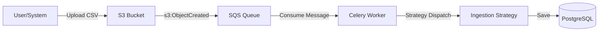

# Django AWS ETL

A robust, event-driven ETL (Extract, Transform, Load) pipeline built with Django, Celery, and AWS services (simulated locally via LocalStack). This project demonstrates a scalable architecture for ingesting healthcare data (e.g., Pharmacy Claims, Audit Records) using S3 event notifications and SQS queues.

## 🏗 Architecture

The system follows a modern event-driven design (see [Status Workflow](docs/status_workflow.md)):

1.  **Upload**: Files (CSV) are uploaded to an S3 Bucket (`healthcare-ingestion-drop-zone`).
2.  **Notification**: S3 publishes a creation event to an SQS Queue (`s3-event-queue`).
3.  **Ingestion**: A Celery worker consumes the event, determines the appropriate strategy based on the file type, and processes the record.
4.  **Storage**: Processed data is stored in a PostgreSQL database.



## 🚀 Features

*   **Ingestion Strategies**: Pluggable strategies for different data types (Pharmacy Claims, Audit Records), managed via a Factory pattern.
*   **Infrastructure as Code**: Terraform manages all AWS resources (Buckets, Queues, Policies).
*   **Local Development**: Fully local environment using LocalStack to mock AWS services.
*   **Reliability**: Dead Letter Queues (DLQ) and robust error handling (implemented in Celery tasks).
*   **Code Quality**: Enforced via `ruff` and `pytest`. Strict "No NOQA" policy; all linting errors must be resolved by refactoring (e.g., using constants, proper imports) rather than suppression.

## 🛠 Prerequisites

*   **Docker Desktop**: Required to run the containerized stack.
*   **Git**: For version control.

## 🏁 Quick Start

1.  **Clone the repository:**
    ```bash
    git clone <repository_url>
    cd django-aws-etl
    ```

2.  **Start the environment:**
    ```bash
    docker-compose up --build
    ```
    This command spins up:
    *   `web`: The Django application (listening on port 8000).
    *   `db`: PostgreSQL database.
    *   `localstack`: AWS emulator (S3, SQS).
    *   `terraform`: Automatically applies `main.tf` to configure LocalStack.
    *   `celery`: Background worker for processing tasks.

3.  **Verify Infrastructure:**
    The `terraform` container runs automatically on startup. You can check the logs to ensure resources were created:
    ```bash
    docker-compose logs terraform
    ```

## 💻 Development

### Project Structure

```text
django-aws-etl/
├── core/                   # Main Django app
│   ├── models/             # Database models
│   ├── strategies/         # ETL Ingestion strategies (Strategy Pattern)
│   ├── tasks/              # Celery tasks and Consumers
│   └── tests/              # Unit and Integration tests
├── main.tf                 # Terraform configuration
├── docker-compose.yml      # Container orchestration
└── pyproject.toml          # Python dependencies and tool config
```

### Running Tests

## Validation Commands

Run the full verification suite (Linting + Tests + Coverage):

```bash
# 1. Linting (Ruff)
docker-compose exec web ruff check .

# 2. Integration Tests
docker-compose exec web pytest core/tests/integration/

# 3. Full Coverage
docker-compose exec web pytest --cov=core
```

### Coverage Goals
The project maintains **100% test coverage**. Any new features must include comprehensive tests.

### Coverage

To run test coverage locally:

```bash
python -m pytest --cov=core
```

To see a formatted report of coverage gaps:

```bash
docker-compose exec web sh -c "pytest --cov=core --cov-report term-missing | python scripts/coverage_report.py"
```

## ☁️ Infrastructure Resources (Terraform)

The `main.tf` files defines the following resources in LocalStack:

*   **S3 Bucket**: `healthcare-ingestion-drop-zone`
*   **SQS Queue**: `s3-event-queue` (Receives S3 notifications)
*   **SQS Queue**: `healthcare-ingestion-queue` (For internal task processing)
*   **S3 Notification**: Triggers an event to `s3-event-queue` whenever a `.csv` file is uploaded.

## 🔄 Data Flow Example

1.  **Simulate an Upload**:
    You can manually upload a file to the LocalStack S3 bucket to trigger the pipeline:

    ```bash
    aws --endpoint-url=http://localhost:4566 s3 cp core/tests/data/pharmacy_claim.csv s3://healthcare-ingestion-drop-zone/
    ```

2.  **Monitor Processing**:
    Watch the Celery logs to see the task pick up the event and process the file:

    ```bash
    docker-compose logs -f celery
    ```
