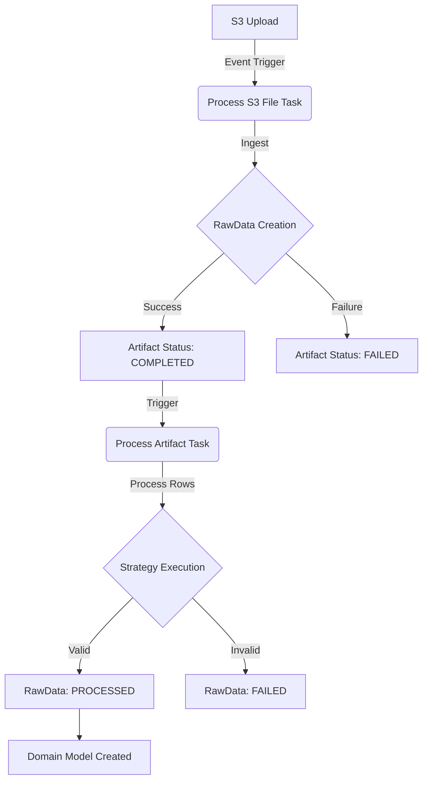

# Artifact Status and Processing Workflow

This document outlines the lifecycle of data ingestion in the application, from S3 upload to domain model creation.

## Lifecycle States

### Artifact Status
| Status | Description |
| :--- | :--- |
| **PENDING** | Initial state (transient). |
| **PROCESSING** | File is being read and parsed into `RawData`. |
| **COMPLETED** | file successfully ingested into `RawData` table. Ready for processing. |
| **FAILED** | Ingestion failed (e.g., malformed CSV, empty file). |

### RawData Status
| Status | Description |
| :--- | :--- |
| **PENDING** | Row parsed from CSV, waiting for strategy application. |
| **PROCESSED** | Successfully transformed and loaded into domain model (e.g., `PharmacyClaim`). |
| **FAILED** | validation or transformation error occurred. See `error_message`. |
